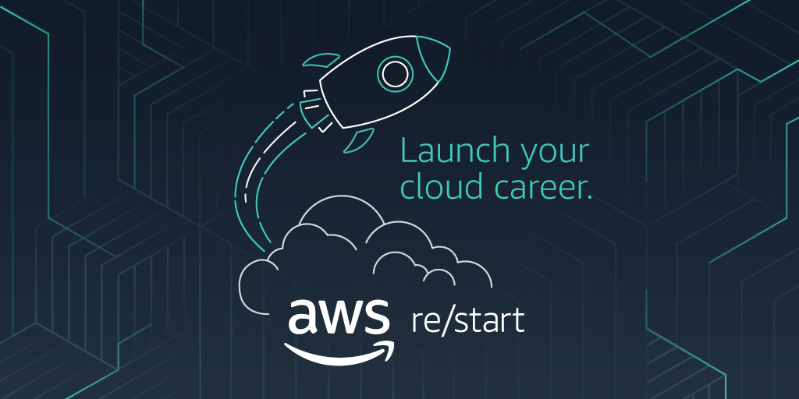

# Quiz AWS Restart

> **Objetivo:** Ajudar nos estudos para o simulado e exame da AWS.

---

## 📌 Instruções

**Leiam a questão, pensem na resposta e só depois confiram o gabarito.**  
Vamos ver como você se sai? **Valendo!** 🎯

---

## 🧠 Quiz

### 1. Qual serviço da AWS oferece um banco de dados altamente escalável e totalmente gerenciado?

- **A)** Amazon S3
- **B)** AWS Lambda
- **C)** Amazon Elastic Compute Cloud (EC2)
- **D)** ✅ Amazon RDS
- **E)** Amazon Elastic File System (EFS)

---

### 2. Qual é o propósito principal do Amazon Elastic Compute Cloud (EC2)?

- **A)** Armazenar e recuperar dados
- **B)** Identificar ameaças de segurança
- **C)** Gerenciar redes virtuais
- **D)** ✅ Oferecer recursos computacionais altamente escaláveis
- **E)** Gerenciar instâncias de bancos de dados

---

### 3. Qual o propósito do AWS Identity and Access Management (IAM)?

- **A)** Gerenciar máquinas virtuais
- **B)** Monitorar performance das aplicações
- **C)** Escalar instâncias de bancos de dados
- **D)** ✅ Controlar o acesso aos recursos da AWS
- **E)** Gerenciar DNS

---

### 4. Qual serviço da AWS pode ser usado para distribuir conteúdos globalmente e acelerar a performance de websites?

- **A)** ✅ Amazon CloudFront
- **B)** Amazon Route 53
- **C)** Amazon S3
- **D)** AWS Beanstalk
- **E)** AWS Lambda

---

### 5. O que o serviço AWS Lambda oferece?

- **A)** Armazenamento de objetos
- **B)** Gerenciamento de bancos de dados
- **C)** Recursos computacionais
- **D)** ✅ Execução de funções sem servidor
- **E)** Gerenciamento de DNS

---

### 6. Quais são os benefícios de usar um banco de dados gerenciado na AWS?

- **A)** Redução de custos
- **B)** Eliminação de tarefas operacionais
- **C)** Escalabilidade automática
- **D)** Segurança aprimorada
- **E)** ✅ Todas as opções anteriores

---

### 7. Qual serviço da AWS oferece um banco de dados gerenciado compatível com Redis e Memcached?

- **A)** Amazon RDS
- **B)** ✅ Amazon ElastiCache
- **C)** Amazon Neptune
- **D)** Amazon DynamoDB
- **E)** Amazon Redshift

---

### 8. Quais tarefas de segurança são responsabilidade do cliente no modelo de responsabilidade compartilhada da AWS? _(Escolha DUAS)_

- ✅ **A)** Garantir que os usuários informem um ID de usuário e senha antes de usar um aplicativo
- **B)** Assegurar o prédio físico onde os servidores estão operando
- ✅ **C)** Criptografar dados sensíveis da aplicação armazenados no Amazon S3
- **D)** Aplicar atualizações de segurança no Amazon DynamoDB
- **E)** Configurar a segurança nos roteadores da zona de disponibilidade

---

### 9. Quando ocorre uma falha do sistema em uma instância EC2, a AMI pode ser usada para iniciar um servidor substituto?

- **A)** ✅ Verdadeiro
- **B)** Falso

---

### 10. A instância EC2 de produção está lenta. Qual a melhor solução?

- **A)** Aumentar o intervalo de IPs da VPC
- **B)** Reescrever o aplicativo
- **C)** ✅ Alterar o tipo da instância para um tamanho maior
- **D)** Pedir à AWS para aumentar a taxa de transferência da VPC

---

### 11. Quais categorias de serviços AWS são fornecidas gratuitamente? _(Escolha DUAS)_

- **A)** Serviços de Computação
- ✅ **B)** Transferência de dados de entrada
- **C)** Transferência de dados de saída
- ✅ **D)** Transferência entre serviços na mesma região
- **E)** Serviços de Armazenamento

---

### 12. Qual é o modelo de nuvem onde os clientes gerenciam os servidores virtuais e software?

- ✅ **A)** Infrastructure as a Service (IaaS)
- **B)** Platform as a Service (PaaS)
- **C)** Software as a Service (SaaS)

---

### 13. Qual serviço da AWS é usado para automatizar o provisionamento de infraestrutura?

- **A)** AWS CLI
- **B)** AWS SDKs
- **C)** AWS Beanstalk
- **D)** AWS Lightsail
- ✅ **E)** AWS CloudFormation

---

### 14. Qual ferramenta ajuda empresas a avaliarem prontidão para a nuvem AWS?

- **A)** AWS Well-Architected Tool
- **B)** AWS Managed Services
- ✅ **C)** AWS Cloud Adoption Framework (CAF)
- **D)** AWS Migration Hub
- **E)** AWS Database Migration Service

---

## ✅ Finalização

Espero que tenha sido útil!  
Se curtiu, deixe uma ⭐ no repositório e compartilhe com os colegas de estudo.  
Em breve, mais quizzes por aqui. 😉

**Obrigada por participarem!**

---
